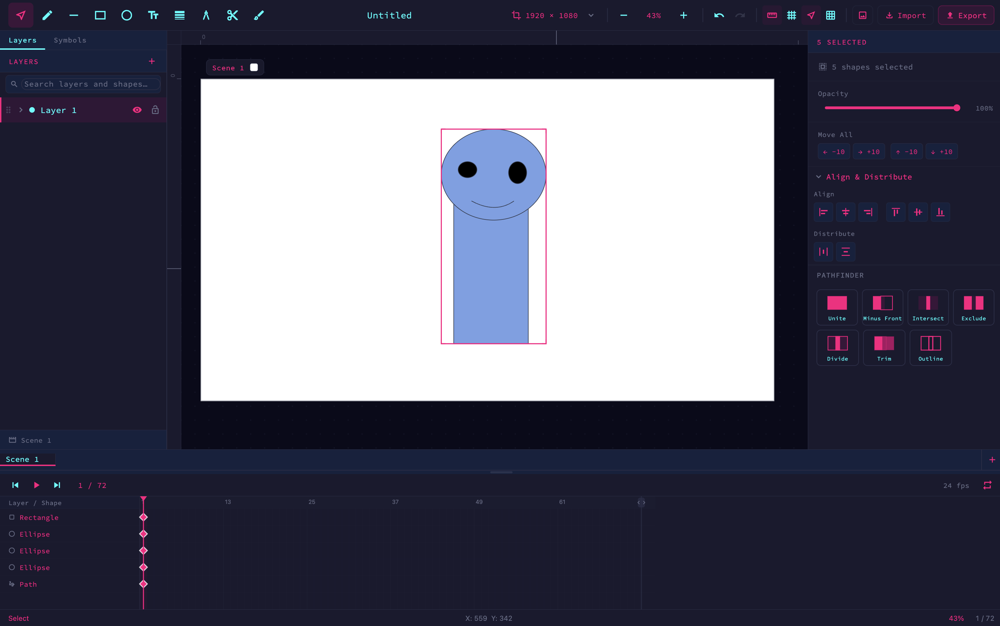

# Vectra

A vector design and animation editor built with Flutter, targeting macOS, iOS, Android, Windows, Linux, and Web.



## Features

### Drawing Tools

| Tool | Shortcut | Description |
|------|----------|-------------|
| Select | `V` | Move, resize, rotate, and transform shapes |
| Pen | `P` | Draw bezier paths with full handle control |
| Line | `L` | Draw straight line segments |
| Rectangle | `R` | Draw rectangles with per-corner radius control |
| Ellipse | `E` | Draw ellipses and circles |
| Text | `T` | Place and inline-edit text shapes |
| Width | `W` | Adjust stroke width profiles along a path |
| Bend | `U` | Bend path segments by dragging |
| Knife | `K` | Freehand-cut closed shapes into two pieces |
| Free Draw | `B` | Freehand brush strokes with Chaikin smoothing |

### Shapes

- **Path** — bezier curves with individual node handles
- **Rectangle** — with independent per-corner radii
- **Ellipse**
- **Text** — with inline editing
- **Image** — raster images embedded as base64 (PNG, JPG, WebP), rendered with contain / cover / fill / none fit modes
- **Group** — nested shapes with isolate-edit mode
- **Symbol / Symbol Instance** — reusable component system

### Styling

- **Fills** — solid colors with opacity; gradient fills
- **Strokes** — color, width, opacity, cap (butt/round/square), join, width profiles
- **Blend modes**
- Per-shape and per-fill/stroke opacity

### Animation

- **Timeline** with per-shape tracks and keyframes
- **Motion paths** — animate shapes along a drawn curve
- **Easing editor** — custom bezier easing per keyframe
- **Playback controls** — play/pause, scrub, frame labels

### Editor

- **Layers panel** — add, reorder, rename, lock, and hide layers and shapes
- **Properties panel** — context-sensitive properties for the selected shape or active tool
- **Pathfinder** — boolean path operations (union, subtract, intersect, exclude)
- **Symbols panel** — manage reusable symbols
- **Smart snap** — snap to objects and grid with visual guide lines
- **Rulers and guides** — drag guides from rulers; remove by dragging back
- **Undo / redo** — full history with atomic multi-shape operations
- **Multi-selection** — marquee select, shift-click, group transform
- **Zoom** — pinch, scroll wheel, keyboard shortcuts (`+`/`-`/`0`)
- **Canvas pan** — space + drag or middle-click drag

### Export / Import

- **SVG export**
- **Lottie export** (JSON animation)
- **SVG import**
- **Image import** (PNG, JPG, WebP) — embedded directly into the document

## Architecture

- **Flutter** + **Riverpod** (hooks_riverpod + riverpod_annotation) for state management
- **Freezed** for immutable data models
- **Custom `CustomPainter` rendering** — scene painter, selection overlays, bend handles, motion path overlay, rulers
- Document model: `VecDocument` → `VecScene` → `VecLayer` → `VecShape` (sealed Freezed union)
- Animation model: `VecTimeline` → `VecTrack` → `VecKeyframe` with per-easing interpolation
- Assets: `VecAsset` with base64-embedded image data

## Getting Started

```bash
flutter pub get
flutter run -d macos
```

Requires Flutter 3.x with Dart SDK ^3.11.
